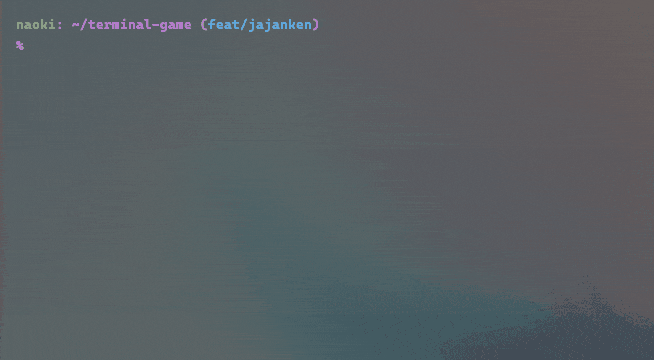

# 🎮 Terminal Game Collection

ターミナル上で楽しめるゲーム集です。学習のアウトプットとして作っています。

## 📋 目次

- [🎯 ゲーム一覧](#-ゲーム一覧)
- [🚀 インストール方法](#-インストール方法)
- [🎮 遊び方](#-遊び方)

## 🎯 ゲーム一覧

### 1. 数字予想ゲーム (Number Guessing Game)


### 2. じゃんけんゲーム (Jajanken)


## 🚀 インストール方法
### クローンとビルド
```bash
# リポジトリをクローン
git clone https://github.com/nka21/terminal-game.git
cd terminal-game
```

## 🎮 遊び方

### クイックスタート
```bash
# ゲーム一覧を表示
make

# 各ゲームを開始
make number_guessing
make jajanken
```

### 利用可能なコマンド

| コマンド | 説明 |
|---------|------|
| `make` | ゲーム一覧を表示 |
| `make {ゲーム名}` | 各ゲームを開始 |
| `make clean-all` | ビルドファイルを削除 |
| `make help` | ヘルプを表示 |